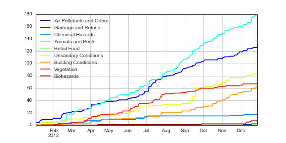
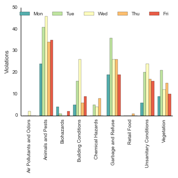
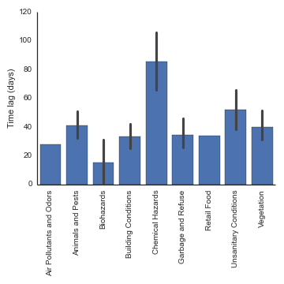

CodeForAmerica
==============

They didn't accept my application but my solution using Python's datetime library was far more elegant that this "I know how to use Microsoft Excel"-esque clearly not real data science trash. Not only that, but my pure text implementation results in fewer lines of code and more parseable output, not to mention the ability to use dynamic datetime objects in Python as a more Object-Oriented and potentially webservice based (via, say, Django) than this pitiful static one-off report. Furthermore, Python's versatility and portability as a scripting language is unparalleled and very well maintained especially on high performance supercomputing clusters running any variant of Rocks.

Original Trash
--------------

This analysis examines data released by CodeForAmerica about code violations. I'm going to perform some basic descriptive data visualizations to understand the changes in these violations, their distribution across days of the week, and which types of violations take the longest time to resolve.

Grouping the violation categories together, I plot the cumulative number of violations over time in the Figure below. The `Animals and Pests` category has the most total violations by the end of the year, followed by `Garbage and Refuse`. Some categories like `Animals and Pests` grow at a relatively constant rate, suggesting a consistent underlying pattern, while other categories like `Unsanitary Conditions` have discontinuous changes suggesting one-time events are responsible.

We can examine if there are any differences in violation_category by day of the week. Each violation has a set of 5 colored bars, reflecting the 5 days of the work week (Dark Green (0) is Monday, Red (4) is Friday). The distribution of violations is not evenly distributed throughout the week: several of the violations have mid-week peaks. This suggests several possible mechanisms. First, people may be more sensitive to violations in the middle of the week compared to the beginning or end of the week. Second, enforcement of regulations may drop off in the middle of the week which leads to more reporting of violations. Third, we have no base rates of overall activity in the city so observed violations may be a constant fraction of activity, but activity peaks mid-week so violations do as well.

Finally, we look at the distribution of the issue_lag variable, which captures the time elapsed between the reporting of a violation to its closure. Some violations may be easier to address and solved in less time, but there may also be systematic biases towards solving some violations quickly and others more slowly. Chemical Hazards take upwards of 80 days on average to close while Biohazards take less than 20 days on average to close.

